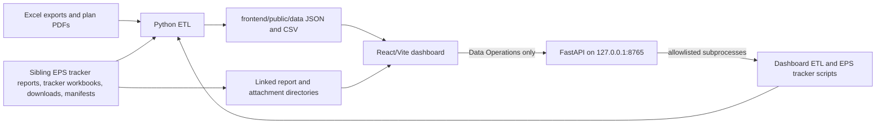

# Architecture

## Purpose

The IAD6 Infralink Dashboard combines engineering exports and locally managed
test/report artifacts into operational views centered on PDMs and equipment.
It covers readiness, issues, Infralink NETA evidence, third-party EPS execution,
monthly KPR metrics, data quality, floor/power-plan views, and MV equipment.

The repository contains two distinct runtime surfaces:

1. A React dashboard that primarily reads generated static JSON.
2. A local FastAPI control plane that runs a fixed set of Python automation
   jobs against this repository and a sibling EPS tracker repository.

## System Flow

## Frontend Architecture

### Entry and routing

- `frontend/src/main.tsx` mounts `App` inside `BrowserRouter`.
- `frontend/src/App.tsx` owns route composition, common layout, loading/error
  boundaries, and return-to-Overview/KPR navigation state.
- Current routes: `/overview`, `/kpr`, `/pdms`, `/equipment`, `/issues`,
  `/eps-test-execution`, `/power-plan`, `/mv-equipment`, `/data-quality`, and
  `/data-operations`.
- `KprPage` is lazy-loaded; other pages are statically imported.

### Data loading

`frontend/src/hooks/useDashboardData.ts` loads data in two tiers:

- Initial operational data: PDMs, summary/metadata, EPS datasets, manifests,
  power-plan data, CxAlloy status, history, and KPR summary.
- Deferred detail data: equipment, cases, module links, and data-quality report,
  loaded only for routes that need them.

The loader distinguishes initial and detail error states, but `fetchJson`
currently converts HTTP/network/parse failures to `null` plus a console warning;
missing files can therefore yield empty/null data rather than throwing. Several
specialist datasets are explicitly optional. `unwrapRecords` accepts both plain
arrays and record envelopes.

### UI organization

- `pages/` contains route-level screens.
- Domain components live under `components/{pdms,equipment,issues,overview}`.
- Shared visual primitives are under `components/common` and `components/ui`.
- Domain calculations, matching helpers, search, report linking, and Excel
  exports are under `utils/`.
- `types/data.ts` and `types/automation.ts` are the frontend contracts.
- Tests are colocated as `*.test.ts` and `*.test.tsx`, using Vitest, jsdom, and
  Testing Library.

The Equipment page flattens PDM equipment plus standalone equipment records so
that equipment missing from module links can still appear in global metrics and
lookup. URL query parameters carry drill-down filters from Overview and KPR.

## ETL Architecture

### Inputs and discovery

`scripts/etl/file_discovery.py` selects the newest non-temporary workbook from:

- `raw_data/module/*.xlsx`
- `raw_data/system_elements/SystemElements_*.xlsx`
- `raw_data/cases/Cases_*.xlsx`

Power-plan builders also read PDFs from `raw_data/power_plan/`. Several EPS,
NETA, attachment, CxAlloy, and MV inputs are read from a sibling
`IAD6_EPS_Testing_Tracker` repository.

### Pipeline

`scripts/etl/run_etl.py` is the orchestrator. It runs, in order:

1. Workbook inspection and normalization of equipment, modules, and cases.
2. Equipment matching for module links and cases.
3. PDM dataset, summary, and data-quality report construction.
4. Seven-day/history, EPS execution, and monthly KPR datasets.
5. NETA, CxAlloy, issue-attachment, and power-plan/MV manifests.
6. ETL metadata and record-count reporting.

Each step writes under `frontend/public/data/`. The directory is generated and
gitignored. JSON outputs commonly include selected-input metadata and a
`records` array. The ETL stops on the first failed step; quality findings are
reported as data and do not stop the pipeline.

### Matching and assignment

- Equipment matching proceeds through exact, project-prefixed/normalized,
  whitespace/case-normalized, and terminal-suffix matching.
- A trailing `0x-R` and `0xR` suffix are treated as equivalent.
- Unique matches are `matched`; multiple matches are `ambiguous`; unmatched
  records are retained.
- PDM assignment may use a SystemElements parent only when it is a PDM and does
  not conflict with the module-list area scope.

### Main data models

There is no database. `scripts/etl/schemas.py` defines the normalized dataclass
contracts:

- `Equipment`
- `ModuleEquipmentLink`
- `CaseIssue`
- `PdmRecord`
- `PdmEquipmentRecord`
- `NetaValidationRecord`
- `DataQualityReport`

The primary hierarchy is PDM -> equipment -> cases. Additional generated models
cover EPS test items and module/PDM execution, KPR lifecycle/trends, report and
attachment manifests, power-plan annotations, MV daily test status, and
CxAlloy upload status.

## Automation Backend

`scripts/automation/api.py` exposes a FastAPI API. `scripts/automation/runner.py`
implements an allowlisted, single-active-run task manager with persisted run
records/logs under `runtime/automation/` (latest 50 exposed by the API).

API groups:

- Health, job definitions, runs, incremental logs, cancellation, and resume.
- Daily pipeline execution.
- JC2 and CxAlloy interactive login continuation.
- EPS and MV daily-report list/read/validate/save operations.

The daily pipeline runs preflight, JC2 workbook refresh, daily report wash,
NETA/Feeder ATP/issue downloads, GC organization, and dashboard ETL. It stops at
the first failure and can resume from a failed/auth-required/interrupted step.
Saving an EPS daily report atomically writes the Markdown file and starts the
wash job; saving an MV report does not run the EPS wash.

Commands are assembled from `JOB_DEFINITIONS`; clients cannot submit script
paths or arbitrary commands. Options are validated per job. Live CxAlloy upload
is marked dangerous and requires confirmation.

## Authentication and Authorization

- The dashboard itself has no login, user model, roles, or authorization layer.
- The automation service is started on `127.0.0.1:8765`; CORS permits only
  localhost/loopback origins.
- JC2 and CxAlloy authentication is delegated to Playwright-driven sibling
  scripts. Browser state is stored outside the repository under local app data.
- Data Operations is not suitable for external exposure in its current form.
- Vite's Feeder Cable ATP middleware only serves `.pdf` files resolved inside
  the configured ATP directory.

## External Integrations

- JC2: SystemElements/Cases exports, NETA reports, Feeder Cable ATP PDFs, issue
  and corrective attachments.
- Sibling EPS tracker: tracker Excel data, EPS and MV daily Markdown reports,
  report downloads, GC rename/upload manifests, and automation scripts.
- CxAlloy: optional confirmed report upload and upload-status reconciliation.
- Local filesystem links/junctions expose downloaded NETA and issue files under
  `frontend/public/` for browser viewing.

No integration credentials or endpoints belong in this repository.

## Configuration and Environment

- `IAD6_EPS_TRACKER_ROOT`: overrides the sibling tracker root for automation,
  CxAlloy status, power-plan/MV processing, and Vite ATP serving where supported.
- `VITE_AUTOMATION_API_URL`: overrides the frontend automation API base URL.
- `LOCALAPPDATA`: used indirectly to locate local browser auth-state files.
- `config/equipment_lifecycle.json`: lifecycle order, labels, status aliases,
  and colors used by KPR.
- The sibling tracker owns the configurable JC2 SystemElements view URL.

Secret values, browser state, raw exports, generated data, downloads, and
runtime logs are excluded from version control.

## Local Development and Deployment

`python scripts/start_dashboard.py` starts Uvicorn with reload on loopback port
8765 and Vite on loopback port 5173, and terminates both on Ctrl+C. The frontend
can also run independently with `npm run dev` after ETL data exists.

`npm run build` produces static assets in `frontend/dist/`. A static deployment
can serve dashboard pages and generated public data, but Data Operations and
local file integrations require the Python service, tracker repository, and
filesystem access. No database service is required.

## Important Decisions and Constraints

- PDM data is the principal grouping, while global Equipment also includes
  unlinked SystemElements records.
- NETA completion/report evidence and lifecycle inventory are separate metrics.
  Lifecycle stages are mutually exclusive and ordered by configuration.
- EPS is tracked at test-item/component level and must not be compared directly
  to equipment-level NETA totals without an explicit unit label.
- Issue and corrective evidence is preserved even when missing; missing values
  drive quality findings.
- Equipment containing `BATTERY`, `UPS6`, or `MBC`, plus direct `INV6`, is
  excluded from EPS/NETA tracking. Transformer IDs such as `TX-INV6` remain in
  scope.
- Report and attachment binaries remain outside generated JSON; manifests store
  metadata and browser paths.
- Data Operations intentionally remains a local control plane rather than a
  general remote execution API.

## Directory Map

| Path | Responsibility |
| --- | --- |
| `frontend/src/App.tsx` | Routes, loading boundaries, return navigation |
| `frontend/src/hooks/useDashboardData.ts` | Initial and deferred JSON loading |
| `frontend/src/pages/` | Dashboard route implementations |
| `frontend/src/types/` | Frontend data and automation contracts |
| `frontend/src/utils/` | Domain logic, search, links, and exports |
| `scripts/etl/run_etl.py` | Full ETL orchestration and metadata |
| `scripts/etl/schemas.py` | Normalized Python data contracts |
| `scripts/etl/tracking_rules.py` | Shared EPS/NETA inclusion rules |
| `scripts/etl/build_eps_test_execution.py` | Third-party test execution datasets |
| `scripts/etl/build_kpr_summary.py` | Monthly KPR and lifecycle movement |
| `scripts/etl/build_power_plan.py` | PDF annotations, MV tests, ATP evidence |
| `scripts/automation/api.py` | Local HTTP API |
| `scripts/automation/runner.py` | Allowlisted task and pipeline execution |
| `scripts/automation/daily_reports.py` | Safe EPS/MV Markdown handling |
| `config/equipment_lifecycle.json` | Ordered lifecycle definition |

## Known Gaps

- **Unknown:** The production hosting, reverse proxy, TLS, and CI/CD design is
  not present in this repository.
- **Unknown:** Canonical Python and Node.js versions are not pinned by project
  metadata.
- **Needs verification:** `vite.config.js`/`vite.config.ts` and
  `tailwind.config.js`/`tailwind.config.ts` coexist and are not equivalent; the
  intended source-of-truth configuration should be confirmed before cleanup.
- **Needs verification:** Some ETL manifest builders use a fixed sibling tracker
  path while other components honor `IAD6_EPS_TRACKER_ROOT`.
- **Needs verification:** Decide whether missing required dashboard JSON should
  fail loudly; the shared fetch helper currently returns `null` after logging.
- **TODO:** Add authentication/authorization and a supported deployment design
  before allowing remote access to Data Operations.
- **TODO:** Define a lint tool and command if lint enforcement is required.
